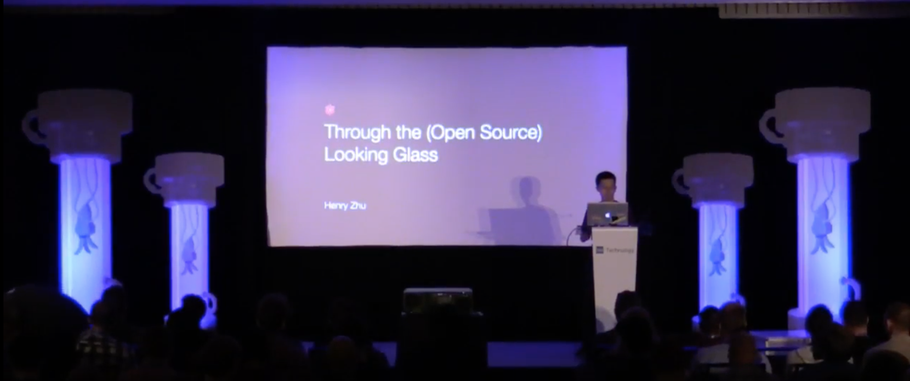

# Through the (Open Source) Looking Glass

## [Slides](https://www.henryzoo.com/through-the-open-source-looking-glass) | [Video](https://youtu.be/h0sfFX7WH1c) | [Stream Link](https://youtu.be/ii-T6HrkZFM?t=5h29m42s) | ~20min

At: [React Rally 2018](http://www.reactrally.com/schedule)

## Babel Song (Hallelujah -- In Praise of Babel)

[`SONG.md`](https://github.com/babel/babel/blob/master/SONG.md), [Youtube](https://www.youtube.com/watch?v=40abpedBKK8)

## Quotes

- "He doesn't call the qualified, but rather qualifies the called"
- "You either die a hero, or live long enough to see yourself become the villain." -The Dark Knight
- "...but that at last we should gain a habit, which will naturally produce its acts in us, without our care, and to our exceeding great delight." -Brother Lawrence
- "The virtues of community sound like their opposites: diligence, patience, and humility." -Larry Wall

## Other Related Talks

- JSConf EU 2017: https://github.com/hzoo/maintaining-an-oss-project
- React Rally 2017: https://github.com/hzoo/so-how-does-babel-even-work
- React Boston 2017: https://github.com/hzoo/maintainer-heal-thyself
- Zeit Day SF 2018: https://github.com/hzoo/in-pursuit-of-open-source

## Getting involved in Babel
- [Babel Org on Github](https://github.com/babel)
- [Babel Proposals Repo](https://github.com/babel/proposals)
- [Babel Meeting Notes](https://github.com/babel/notes)
- [Babel Website Repo](https://github.com/babel/website)
- [Babel Twitter](https://twitter.com/babeljs)
- [Slack sign-up](slack.babeljs.io)
